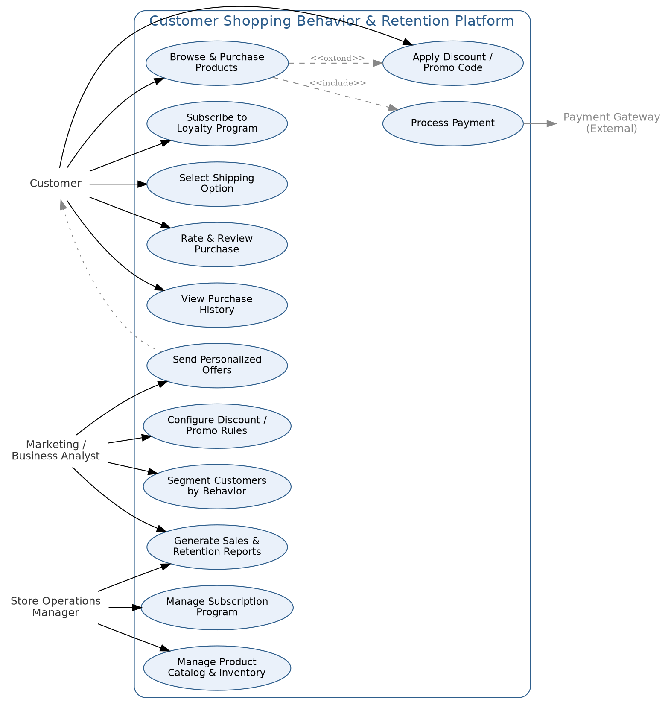

# Use Case Diagram & Descriptions
### Customer Shopping Behavior & Retention Platform

The diagram below shows the actors and use cases for the Customer Retention & Personalization Initiative. Dashed lines indicate `<<include>>` / `<<extend>>` relationships between use cases.

*Figure 1: Use Case Diagram — Customer Shopping Behavior & Retention Platform*

## 1. Actors
- **Customer** — the end shopper interacting with the storefront.
- **Marketing / Business Analyst** — configures segments, discount rules, and reviews performance.
- **Store Operations Manager** — manages catalog, inventory, and the subscription program.
- **Payment Gateway** *(external)* — third-party system that processes payment; outside solution scope.

## 2. Key Use Case Descriptions

### UC-2: Apply Discount / Promo Code
| Field | Detail |
|---|---|
| Actor | Customer (primary), Marketing/BA (configures rule) |
| Precondition | Customer's segment matches an active, targeted promo rule. |
| Main Flow | 1. Customer adds item to cart. 2. System evaluates customer segment against active rules. 3. Eligible promo code is auto-applied or offered. 4. Customer completes purchase (extends UC-1). |
| Postcondition | Discount usage and segment are logged for ROI reporting (FR-9). |
| Related Requirements | BR-2, FR-2, FR-9 |

### UC-3: Subscribe to Loyalty Program
| Field | Detail |
|---|---|
| Actor | Customer |
| Precondition | Customer is not currently subscribed. |
| Main Flow | 1. System displays subscription prompt at browse, cart, or post-purchase (FR-8). 2. Customer opts in. 3. System updates Subscription Status and, per current bundling pattern, applies the associated discount treatment. |
| Postcondition | Customer is enrolled; future personalization reflects subscribed status. |
| Related Requirements | BR-6, FR-8 |

### UC-7: Segment Customers by Behavior
| Field | Detail |
|---|---|
| Actor | Marketing / Business Analyst |
| Precondition | Transaction and demographic data is available in the system of record. |
| Main Flow | 1. Analyst selects segmentation attributes (age, category, frequency, subscription, etc.). 2. System generates segment membership. 3. Analyst saves segment for use in campaigns or dashboards. |
| Postcondition | Segment is available for targeted discounting (UC-8) and reporting (UC-10). |
| Related Requirements | BR-1, FR-1 |

### UC-13: Send Personalized Offers
| Field | Detail |
|---|---|
| Actor | Marketing / Business Analyst (configures), System (executes) |
| Precondition | Customer is flagged at-risk or matches a targeted segment. |
| Main Flow | 1. System identifies eligible customers (at-risk or segment match). 2. System sends personalized offer via email/on-site banner. 3. Customer response is logged for conversion tracking. |
| Postcondition | Offer engagement feeds back into dashboard KPIs (UC-10). |
| Related Requirements | BR-3, FR-3, FR-4 |
