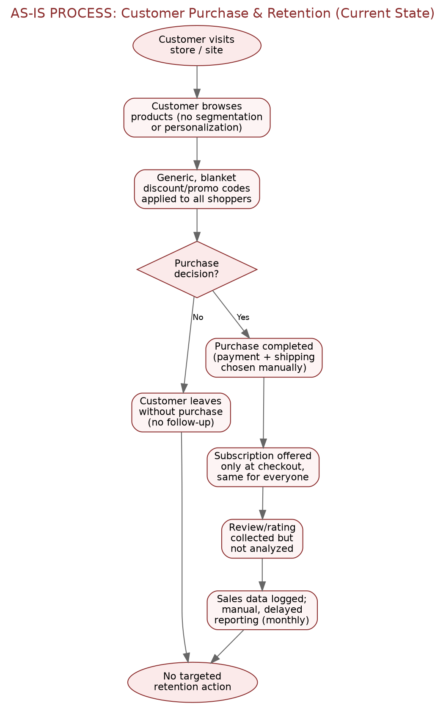
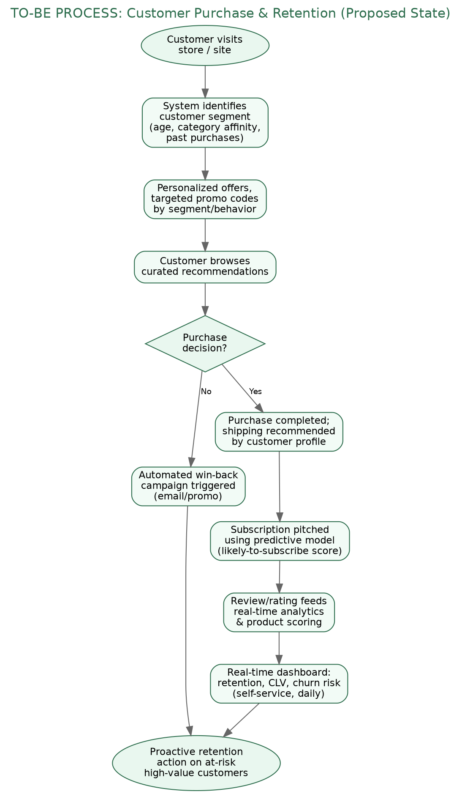

# As-Is vs To-Be Process Maps
### Customer Purchase & Retention Journey

These process maps contrast the current (As-Is) customer purchase and retention flow with the proposed (To-Be) flow that incorporates segmentation, targeted offers, and automated retention triggers.

## 1. As-Is Process (Current State)

*Figure 2: As-Is Process — Customer Purchase & Retention*

**Key characteristics:** undifferentiated browsing experience, blanket discounting, no automated response to abandoned carts, subscription offered only once at checkout, and review data collected but not analyzed. Reporting is manual and monthly, meaning issues are identified weeks after they occur.

## 2. To-Be Process (Proposed State)

*Figure 3: To-Be Process — Customer Purchase & Retention*

**Key improvements:** customer segment is identified up front and used to personalize offers and promo targeting; abandoned/at-risk customers trigger an automated win-back flow instead of being lost silently; subscription is pitched using a predictive "likely-to-subscribe" score at multiple touchpoints; review ratings feed real-time analytics; and a live dashboard drives proactive retention action instead of a monthly retrospective report.

## 3. As-Is → To-Be Summary

| Step | As-Is | To-Be |
|---|---|---|
| Browsing | No segmentation or personalization | Segment identified up front; curated recommendations |
| Discounting | Generic, blanket promo codes for everyone | Personalized offers targeted by segment/behavior |
| Cart abandonment | Customer leaves, no follow-up | Automated win-back campaign triggered |
| Subscription pitch | Offered once, at checkout, same for everyone | Pitched using a predictive propensity score, multiple touchpoints |
| Review data | Collected but not analyzed | Feeds real-time analytics & product scoring |
| Reporting | Manual, delayed (monthly) | Real-time dashboard (retention, CLV, churn risk) |
| Retention action | None / reactive | Proactive action on at-risk, high-value customers |
