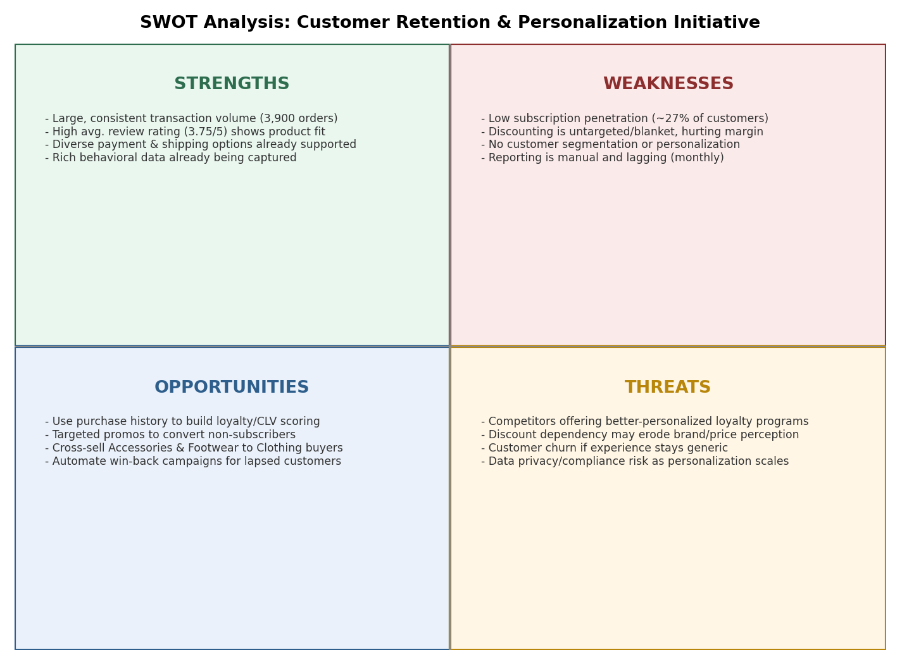

# SWOT Analysis
### Customer Retention & Personalization Initiative

The SWOT below evaluates the business's position for the proposed retention and personalization initiative, grounded in the transaction data profile.

*Figure 4: SWOT Analysis — Customer Retention & Personalization Initiative*

## Discussion

### Strengths
- A high transaction volume (3,900 records) and average 25 previous purchases per customer indicate an already-engaged base to build on, not one that must be acquired from scratch.
- A healthy average review rating (3.75/5) suggests the core product experience is not the barrier to retention — targeting and personalization are the lever.
- Diverse payment & shipping options are already supported.
- Rich behavioral data is already being captured.

### Weaknesses
- 27% subscription penetration and untargeted discounting are self-inflicted — both are process gaps, not market constraints, and are directly addressable by this initiative.
- Discounting is untargeted/blanket, hurting margin.
- No customer segmentation or personalization.
- Reporting is manual and lagging (monthly).

### Opportunities
- Footwear (15.4%) and Outerwear (8.3%) purchase share, relative to Clothing (44.5%) and Accessories (31.8%), represents clear cross-sell headroom for existing customers.
- Targeted promos to convert non-subscribers.
- Automate win-back campaigns for lapsed customers.

### Threats
- If competitors personalize first, the retailer's currently loyal, high-previous-purchase customer base becomes a target for competitor win-back campaigns — reinforcing the urgency of BR-3.
- Discount dependency may erode brand/price perception.
- Customer churn risk if the experience stays generic.
- Data privacy/compliance risk as personalization scales.
