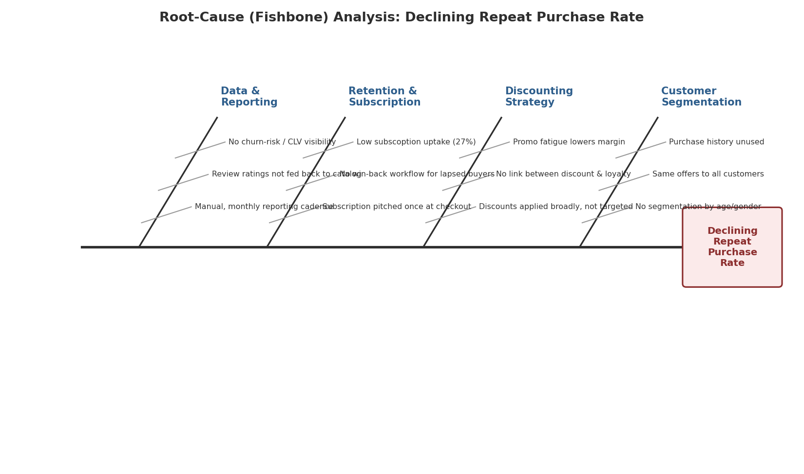

# Root-Cause Analysis
### Customer Retention & Personalization Initiative

## 1. Problem Statement
**Business Problem:** Repeat purchase and subscription conversion are lower than they should be, given an engaged, data-rich customer base.

## 2. Fishbone (Ishikawa) Diagram

*Figure 5: Fishbone Diagram — Root Causes of Declining Repeat Purchase Rate*

## 3. Five Whys

| Step | Question | Answer |
|---|---|---|
| Why 1 | Why is repeat purchase / subscription conversion lower than it should be? | Because most customers (73%) never convert to the subscription program. |
| Why 2 | Why don't customers convert? | Because the subscription offer is shown only once, at checkout, with no follow-up. |
| Why 3 | Why is it only shown at checkout with no follow-up? | Because there is no segmentation or scoring to know who is likely to convert or when to re-approach them. |
| Why 4 | Why is there no segmentation or scoring? | Because existing customer data (age, category, frequency, review rating) has never been operationalized into segments. |
| Why 5 | Why hasn't the data been operationalized? | Because reporting has been manual and monthly — there has been no system or process built to turn raw transaction data into real-time, actionable segments. |

## 4. Root Cause
The absence of a **segmentation and real-time analytics capability** (not a lack of data) is the root cause of both low subscription conversion and inefficient, untargeted discounting. This validates **BR-1** and **BR-4** as the highest-leverage requirements in the BRD — addressing them unlocks the remaining requirements (BR-2, BR-3, BR-5, BR-6).
